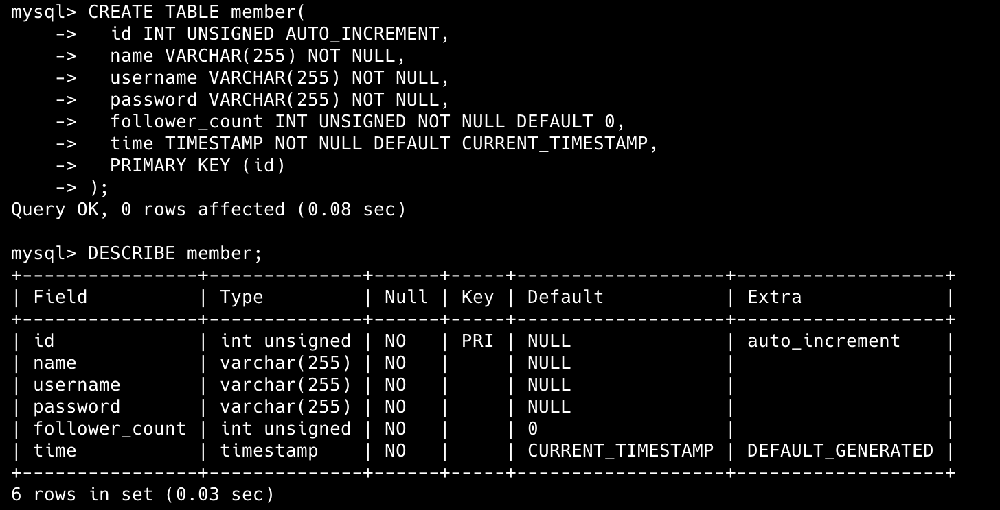

# Week 5 
## Task 2 : Create database and table in your MySQL server
```
mysql> CREATE DATABASE IF NOT EXISTS website
    -> USE website;

mysql> CREATE TABLE member(
    ->   id INT UNSIGNED AUTO_INCREMENT,
    ->   name VARCHAR(255) NOT NULL,
    ->   username VARCHAR(255) NOT NULL,
    ->   password VARCHAR(255) NOT NULL,
    ->   follower_count INT UNSIGNED NOT NULL DEFAULT 0,
    ->   time TIMESTAMP NOT NULL DEFAULT CURRENT_TIMESTAMP,
    ->   PRIMARY KEY (id)
    -> );
```


## Task 3 : SQL CRUD
### 3-1
```
mysql> INSERT INTO member (name, username, password, follower_count)
    -> VALUES
    -> ('test', 'test@test.com', 'test', 3),
    -> ('Rachel', 'Rachel@test.com', 'pw1', 4),
    -> ('Monica', 'Monica@test.com', 'pw2', 7),
    -> ('Chandler', 'Chandler@test.com', 'pw3', 2),
    -> ('Ross', 'Ross@test.com', 'pw4', 1);
```


###3-2
